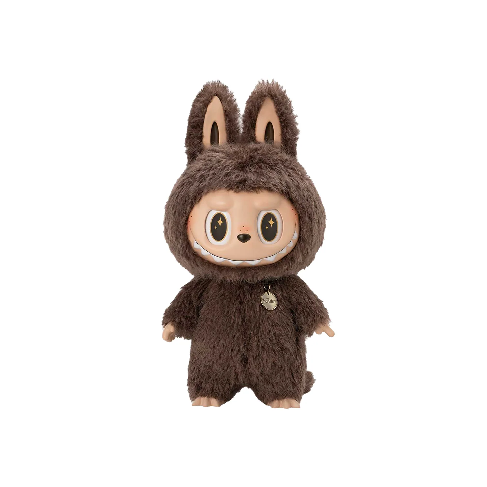

# Labubu Web - Fashion Brand Website

A modern, responsive fashion brand website showcasing the Labubu collection with contemporary design and interactive features.




## 🌟 Overview

Labubu Web is a stylish, single-page application that represents a fashion-forward brand where "Style Meets Character." The website features a contemporary design with smooth animations, responsive layout, and an elegant user interface that showcases various fashion collections and accessories.

## ✨ Features

- **Responsive Design**: Fully responsive layout that works seamlessly across desktop, tablet, and mobile devices
- **Modern UI/UX**: Clean, contemporary design with smooth animations and transitions
- **Interactive Navigation**: Mobile-friendly hamburger menu with smooth scrolling navigation
- **Collection Showcase**: Dynamic product galleries with modal windows for detailed views
- **Newsletter Subscription**: Functional email subscription form with validation
- **Social Media Integration**: Links to various social media platforms
- **Performance Optimized**: Fast loading times with optimized images and efficient CSS/JS

## 🎨 Design Highlights

- **Typography**: Elegant combination of Playfair Display and Poppins fonts
- **Color Scheme**: Sophisticated neutral palette with warm accent colors
- **Animations**: Subtle scroll animations and hover effects
- **Layout**: Grid-based responsive design with clean sections
- **Accessibility**: Proper contrast ratios and semantic HTML structure

## 🛠️ Technologies Used

- **HTML5**: Semantic markup structure
- **CSS3**: Modern styling with CSS Grid, Flexbox, and CSS Variables
- **Vanilla JavaScript**: Interactive functionality without dependencies
- **Font Awesome**: Icon library for UI elements
- **Google Fonts**: Custom typography (Playfair Display, Poppins)

## 📁 Project Structure

```
Labubu-Web/
├── assets/
│   ├── fonts/          # Custom font files
│   └── images/         # Product images and assets
│       ├── labubu-portrait.webp
│       ├── mega-labubu.jpg
│       ├── labubu x pronounce.jpg
│       ├── labubu-earphone.jpg
│       └── labubu-time.jpg
├── css/
│   └── style.css       # Main stylesheet
├── js/
│   └── script.js       # JavaScript functionality
├── index.html          # Main HTML file
└── README.md           # Project documentation
```

## 🚀 Getting Started

### Prerequisites

- A modern web browser (Chrome, Firefox, Safari, Edge)
- A local web server (optional, for development)

### Installation

1. **Clone the repository**:

   ```bash
   git clone https://github.com/invesigator/Labubu-Intro.git
   cd labubu-web
   ```

2. **Open the project**:

   - For basic viewing: Simply open `index.html` in your web browser

## 📱 Features Overview

### Hero Section

- Eye-catching header with brand messaging
- Call-to-action button with smooth scroll
- Animated scroll indicator

### About Section

- Brand story and mission statement
- Key statistics display
- Professional brand imagery

### Collection Gallery

- Interactive product showcase
- Modal windows for detailed product views
- Hover effects and animations

### Features Section

- Brand value propositions
- Icon-based feature highlights
- Grid layout for easy scanning

### Newsletter Subscription

- Email collection form
- Form validation
- Success/error messaging

### Social Media Links

- Multiple platform integration
- Consistent branding
- External link handling

## Demo with Screenshot
### Landing Page


## 🎯 Browser Support

- Chrome 60+
- Firefox 55+
- Safari 12+
- Edge 79+
- Mobile browsers (iOS Safari, Chrome Mobile)


## 🙏 Acknowledgments

- Font Awesome for the icon library
- Google Fonts for typography
- Inspiration from modern fashion brand websites
- The Labubu character and brand imagery

---

**Made with ❤️ for fashion enthusiasts**
